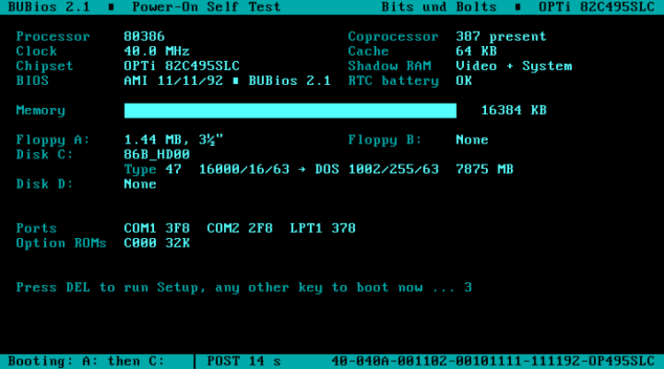
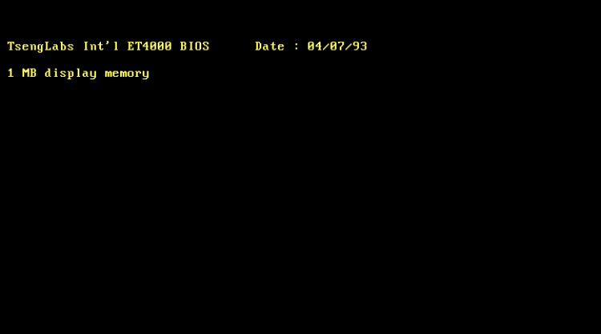
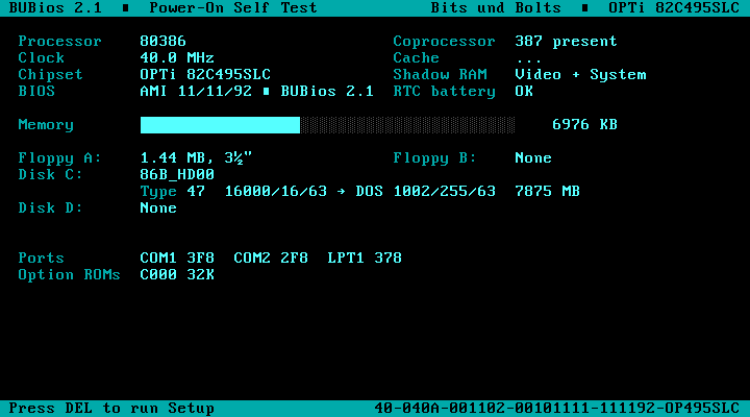
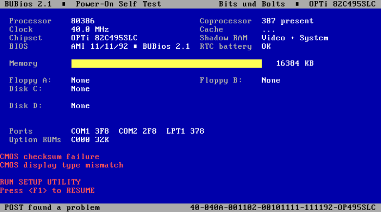
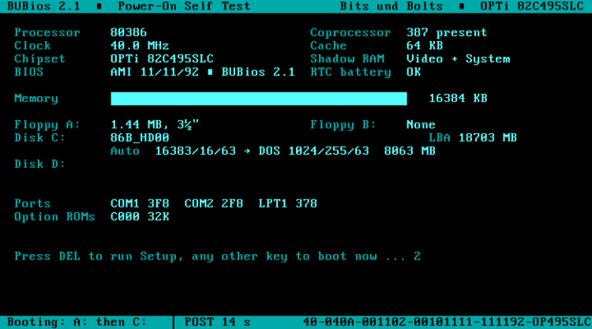
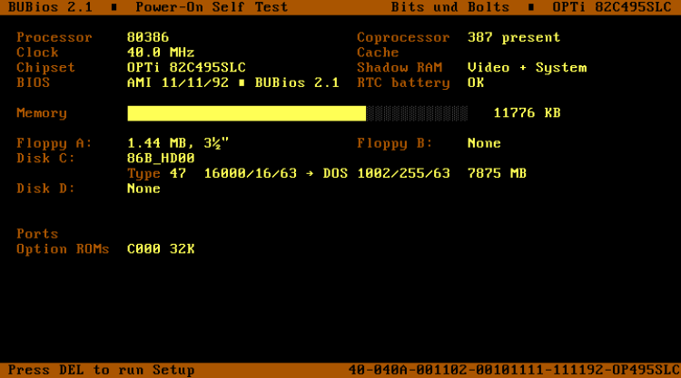
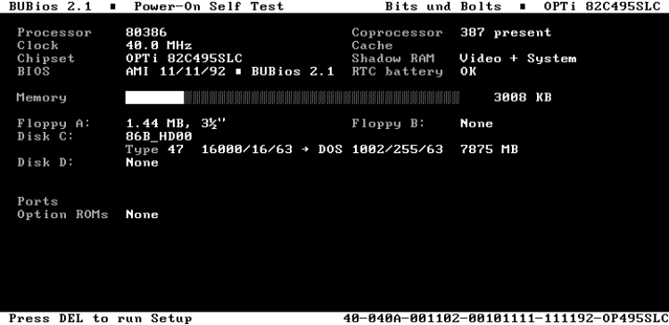
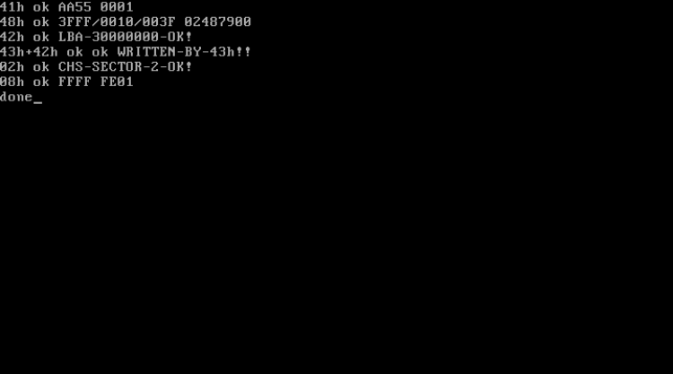

# BUBios 2.1

BUBios 2.x adds a new **POST screen** to the BUBios setup and removes dead AMI code from the ROM to make room for it. Version 2.1 is based on the test of 2.0 on the real board. It adds a boot countdown with DEL for setup, automatic hard disk detection and LBA access through the INT 13h extensions. Everything from BUBios 1.0 (the MR-BIOS-style setup) and from the parent project (ECHS large-disk support up to 8.4 GB) is still there and unchanged.

**Status:** version 2.1 (second build, 2.1b). The first 2.1 build ran on the real board: countdown, auto-detect, error display and boot all work. The second build fills in more fields before the memory test and is verified in both emulators, but has not yet run on the real board. This BIOS generation has no recovery block, so keep the 2.0 chip, the 1.0 chip or the original dump before programming an EPROM.

| | |
|---|---|
| ROM image | `binary/BUBIOS2_SY019L1.BIN` (64 KB, 27C512) |
| MD5 | `ef2babff61e23b201d0543b558b5fac2` |
| Built from | `binary/base/SY019L1_27C512_CHSPATCH.BIN` (ECHS v5, MD5 `8e520e91100f932d3f054883b08d37da`) |
| Setup | BUBios 1.0 setup, version 2.1, one new Tools entry |



## What 2.1 changes

The 2.0 test on the board brought up these points. This is what 2.1 does about each of them:

| Point from the 2.0 test | 2.1 |
|---|---|
| The VGA card's sign-on screen is gone | It stays on screen for 2 s before the POST screen is drawn. If the card prints nothing, POST does not wait. |
| Remove the 1 MB block counter | The memory map row is gone. The progress bar and the KB count stay. |
| DOS writes over the POST screen, in its colours | Just before the boot, the video mode is set again. DOS starts on a clear screen with normal grey-on-black text and the cursor at the top left. |
| Fill in the fields early, and pause before the boot | Everything that can be known before the memory test is shown with the first screen: floppies, disk names and geometry, serial and parallel ports, option ROMs, shadow RAM, battery, and the clock when the early reading is valid. What cannot be known yet (the cache, which AMI sets up last) shows `...` until it is. After POST, a 3-second countdown runs before the boot (see below). |
| Remove the BUBios text at the bottom right | Removed. The BIOS ID string is on the right of the status bar, ending one column from the edge like the title bar. |
| Why does POST crash without "(C) American Megatrends Inc.," on screen? | This is AMI's copyright check, not an error check. It is now switched off, and the line is gone (see below). |
| HDD auto-detect and/or LBA, if there is room | Both are in (see below). About 145 bytes are left in the ROM. |

### The boot countdown

At the end of POST the screen shows:

`Press DEL to run Setup, any other key to boot now ... 3`

The number counts down once a second. The timing comes from the DRAM refresh signal, so it is the same at any CPU clock.

- **DEL** runs the setup, after the password prompt if a password is set.
  - If you leave setup without saving, or save without changing anything, the boot continues.
  - If you save changes, the machine restarts so that POST applies them from the start, including drive types, cache and shadow.
- **Any other key** boots at once.
- With no key, it boots after 3 seconds.

AMI's own "Hit DEL" during the memory test still works as before.

### Why POST crashed without the AMI copyright line

AMI's POST has a tamper check. At checkpoints 40h, 60h and 95h, routine `F3DB` reads text row 21, columns 0-28. If that text is not `(C) American Megatrends Inc.,`, POST jumps into a deliberately unbalanced RET and crashes. With a valid CMOS the check is skipped, which is why it only showed up with a cleared CMOS.

The check detects nothing about the hardware. It only makes sure that the copyright notice is displayed. In 2.1 the first byte of `F3DB` is a RET, so the check does nothing and the POST screen no longer carries the line. The test with a cleared CMOS (errors, F1, setup, boot) passes without it. The AMI copyright text in the ROM is left untouched, as is the ROM's own integrity check (`F419`).

### Automatic hard disk detection

This is a new entry on the setup's **Tools** page: **Auto-Detect Disks at Boot: Off/On**. Press Enter to switch it. It takes effect at once, like the password.

When it is **On**, POST sends IDENTIFY to the master and the slave at every boot. If a drive answers, POST checks the drive-type settings:

- If they are missing or differ from what the drive reports, POST writes them to CMOS as type 47 with the drive's own geometry and fixes the CMOS checksum.
- It does this before AMI sets up the disks, so the drive can be used in the same boot.
- The POST screen says **Auto** instead of **Type 47** for such drives.
- A drive that has spun down (or a CF card) is waited for, up to 10 s, after the memory test.

When it is **Off** (the default), nothing changes: the drive types come from the Standard page as before. The POST screen still asks each configured drive for its name.

The switch is stored in CMOS 7Fh, with a check byte in 7Eh. A cleared or random CMOS reads as Off.

### LBA: INT 13h extensions (EDD 1.1)

INT 13h functions 41h, 42h, 43h, 44h, 47h and 48h are added for hard disks, in the standard form ("fixed disk access subset", EDD 1.1):

| AH | Function |
|---|---|
| 41h | Installation check: BX = AA55h, AH = 21h, CX = 1 |
| 42h / 43h | Read / write up to 127 sectors at a 64-bit LBA address from a disk address packet. The limit is 28 bits, which is 128 GB. |
| 44h | Verify sectors |
| 47h | Seek: accepted, no action (IDE drives seek on their own) |
| 48h | Drive parameters: physical geometry and the total number of sectors (IDENTIFY words 60-61) |

A request that lies completely inside the drive's CHS geometry is sent in CHS form, so drives without LBA work too. A request beyond that uses LBA addressing.

**What does not change:**

- The classic CHS functions (02h, 03h, 08h …) and the ECHS translation are untouched. DOS sees the same 1002/255/63 geometry as before, and existing partitions and installations are not affected.
- `regress_echs.py` passes unchanged.

**What LBA adds:**

- MS-DOS 7.1 (Windows 95 OSR2/98) and other LBA-aware systems use the extensions for partitions of type 0Ch/0Eh/0Fh (FAT32 LBA, FAT16 LBA, extended LBA).
- On a disk larger than 8.4 GB, FDISK can now see and use the whole disk. That is up to 128 GB with 28-bit LBA.
- Your 4 GB card does not need this, but a larger card or disk now works in full.

If a drive reports more sectors through LBA than its CHS geometry reaches (anything over 8.4 GB), the POST screen shows the LBA size on the drive's name row, for example `LBA 18703 MB`.

## The POST screen

| | |
|---|---|
|  |  |
| The video BIOS sign-on stays for 2 s | Memory test: the fields are already filled in |
|  |  |
| Error messages (a cleared CMOS, blue scheme) | Auto-detect on, a 19.6 GB disk not entered in CMOS |
|  |  |
| Amber scheme | Monochrome (MDA) |

*The POST screenshots were taken in 86Box on its OPTi 495 machine with this ROM installed. That is why the disk is called "86B_HD00" and why POST takes about 14 s there.*

| Area | Contents | Filled in |
|---|---|---|
| Title bar | BUBios 2.1, Power-On Self Test | at once |
| Processor | 80386 / 80486 / CPUID family; Cyrix 486DLC-class cores are named as such | at once |
| Coprocessor | 387 present / On-chip / None (FNINIT probe) | at once |
| Clock | measured CPU clock (PIT-timed DIV loop, as on the setup's Summary page, but with 32 DIVs per pass so that slow uncached code fetches early in POST hardly matter) | at once if the reading is within 1/16 of a standard clock; otherwise tried again after the memory test and at the end of POST. `...` until then |
| Cache | external cache size as the OPTi chipset reports it, or Disabled | end of POST (AMI sizes and enables the cache last); `...` until then |
| Shadow RAM, RTC battery | from CMOS | at once |
| Memory | progress bar and count in KB, updated for every 64 KB block AMI tests | live |
| Floppy A:/B: | drive types from CMOS | at once |
| Disk C:/D: | model name read from the drive (IDENTIFY), LBA size if larger than CHS, drive type (or Auto), physical geometry, the geometry DOS sees through ECHS, size in MB | at once; a drive that is still spinning up shows `...` and is identified after the memory test |
| Ports | COM1-4 and LPT1-3 with their I/O addresses | at once: BUBios probes the ports the same way AMI does at checkpoint 9Ah (UART IIR at 3F8/2F8/3E8/2E8, printer data latch at 3BC/378/278). AMI repeats it later and the list is redrawn from its result. `None` only at the end |
| Option ROMs | every ROM found between C000 and EFFF, with its size | at once |
| Message rows | AMI's error messages in red, then the countdown | when needed |
| Status bar | what POST is doing: *Press DEL to run Setup*, *Checking devices*, *POST found a problem*, and at the end the boot order and how long POST took. On the right, the AMI BIOS ID string, ending in column 78 like the title bar (the last column is often hidden by the monitor's overscan) | live |

The end-of-POST beep is replaced by a two-note chime. POST itself is not changed. The sequence of POST checkpoint codes is identical to BUBios 1.0.

The screen uses the colour scheme selected in setup (F2/F3): teal, amber, green, classic blue, grey or AMI. On a monochrome adapter it uses mono attributes.

## Dead code removed

Four pieces of AMI code can no longer be reached. Their space was cleared (4,501 bytes in total):

| Range | Size | What it was | Why it is dead | Used for (2.1) |
|---|---|---|---|---|
| `39C0-3B83`, `3B8F-4033` | 1,641 B | AMI's "System Configuration" box, including its texts | replaced by the POST screen | POST screen |
| `4034-4167`, `429D-49DA` | 2,162 B | Hard Disk Utility: low-level format, auto interleave, media analysis, bad-track editor | not in the menu since BUBios 1.0; format and interleave are meaningless on IDE and CF | POST screen, IDENTIFY, auto-detect |
| `3292-3481` | 496 B | Hard Disk Utility texts | as above | INT 13h extensions |
| `19B0-1A79` | 202 B | cache and CPU-clock lines printed under the configuration box | only called by the box | Tools switch, INT 13h 41h |

These routines lie between or beside those ranges and are kept:

- the CR/LF routine at `3B84-3B8E`
- the drive-information display at `4168-429C`, used by the setup's auto-detect
- the error dialog at `49DB-4A43`
- the error and auto-detect texts at `3482-36D3`

The last entry of AMI's old main-menu handler table (`2ECE`) pointed at the Hard Disk Utility. It now points at a RET.

The dead code was found in three steps:

1. **Recursive disassembly** from the utility's entry point, its two internal jump tables (`332F`, `33B3`) and from every live entry point.
2. **Reference search.** Every CALL and JMP in the ROM was checked for references into the ranges.
3. **Execution check.** All test suites were run with a watch on the removed ranges.

The build script checks the MD5 of every removed range before clearing it, and of every kept neighbour after patching.

**Space left after 2.1:** about 145 bytes, spread over nine small gaps. The build prints the exact numbers. The largest are 39 B (setup data block), 22 B (`429D` block) and 19 B each in the date/time and Tools blocks.

## How it works (short version)

AMI's POST prints through a handful of routines. BUBios replaces those prints or wraps them. It never changes the order of POST or what POST tests.

| Site | Original | Now |
|---|---|---|
| `593B`, `12BF` | logo line `AMIBIOS (C)1992 …` | nothing |
| `5945`, `12C6` | `CALL F42E` (BIOS ID lines) | `bu_post_init`: leaves the video BIOS sign-on up for 2 s, calls F42E (it also sets the A20 gate), draws the screen and identifies the disks (and sets them up if auto-detect is on) |
| `4F04` | "Hit <DEL>, If you want to run SETUP" | `bu_delmsg`: status line |
| `4EA1` | memory count `nnnnnn KB OK` | `bu_memshow`: bar and count |
| `4CB4`, `12CD` | `WAIT......` | `bu_wait`: status line; identifies drives that were not ready yet (up to 10 s with auto-detect) |
| `120D`, `158C` | AMI's error list | `bu_errors`: clears the message rows, then AMI's list |
| `1610` | end-of-POST beep | `bu_chime` |
| `1613` | clear screen before the configuration box | `bu_refresh`: only if the POST screen is not intact (after setup), the mode is reset and the screen redrawn |
| `164C` | configuration box | `bu_final`: clock, cache, ports, boot order, POST time, countdown, then a clean screen for DOS |
| `A3E7` | INT 13h entry | `bu_int13`: AH 41h-48h for hard disks go to the extensions, everything else to AMI/ECHS as before |
| `F3DB` | copyright check | RET |

Notes for anyone changing this code:

- **The memory count runs after a CPU reset.** AMI tests memory in protected mode. For every 64 KB block it resets the CPU back to real mode to print the count. `bu_memshow` is called at that point with AX = blocks counted and DX = blocks left. BP = 1, 0Ah or 10h tells it which pass is running.
- **State between the hooks** is kept in the BDA inter-application area `40:F0-40:FF`, which nothing else uses during POST. `bu_final` clears it before the boot.
- **After IDENTIFY, the master is selected again.** If a missing slave stays selected, AMI's disk setup at checkpoint 91h hangs. The emulator found this bug before any chip was burned.
- **The restart after setup** is a keyboard-controller reset with CMOS shutdown code 0. AMI's chipset setup at checkpoint 05h turns the shadow RAM off again, so the EPROM is checksummed afresh. 86Box confirms the restart.
- **The clock**: the timing loop (500 passes of 32 × `DIV BX` + `LOOP`) is built at `0:7C00` so that it runs from RAM, and timed with PIT channel 2. The constants are the setup's per-instruction timings (386: DIV r16 22 clocks, LOOP 13). The setup itself still uses its 8-DIV loop, where the cache is always on.

## Build and test

Run these from this folder. You need NASM, Python 3 and `pip install unicorn pillow`. This folder has everything else, including copies of the base ROMs and the ECHS test scripts.

```
python3 py/build_bubios.py     # builds binary/BUBIOS2_SY019L1.BIN from binary/base/
python3 py/test_bubios.py      # 73 checks of the setup
python3 py/test_post.py        # 77 checks of POST, countdown, auto-detect, LBA (20-30 minutes)
python3 py/regress_echs.py     # ECHS INT 13h regression + INT 19h boot test
python3 py/shots.py            # setup screenshots into shots/
```

- **`post_emu.py`** runs the complete POST from the reset vector in Unicorn. It models:
  - the PICs, PIT, keyboard controller (including the CPU reset), DMA, RTC/CMOS and the OPTi index ports
  - the floppy controller, and master and slave IDE drives with IDENTIFY, CHS and LBA addressing, reads, writes and errors
  - a colour VGA or a monochrome adapter
- **`int13x.py`** runs single INT 13h calls on the emulated machine after POST. `test_post.py` uses it for the extensions:
  - 41h, 48h, 42h and 43h above 8.4 GB, read-back, verify, seek
  - errors (past the end of the disk, more than 127 sectors, a missing drive)
  - the classic CHS read and AH=08h, unchanged
- **`test_post.py`** also checks:
  - the screen in the normal case, and the early fields during the memory test
  - the countdown: 3 s, any key boots, DEL runs setup, a save restarts POST
  - the cleared screen and normal colours for DOS
  - memory sizes of 4 to 64 MB, no disk, master plus slave, a small ROM-table drive
  - auto-detect with no CMOS entries and with wrong ones
  - a cleared CMOS without the copyright line, including F1 into setup
  - the colour schemes, monochrome and the chime
  - that the POST checkpoint sequence is identical to BUBios 1.0
- **86Box** (v6.0, machine *[OPTi 495] DataExpert OPTi-495SX*, with `roms/machines/ami495/opt495sx.ami` replaced by this ROM) ran the full POST on an emulated 386DX-40 with a 387, a Tseng ET4000 or MDA card and an IDE disk. It confirmed:
  - the ET4000 sign-on
  - the 40.0 MHz clock reading
  - the countdown, and DEL → setup → F10 → restart
  - auto-detect of a 19.6 GB disk (38000/16/63) that was not in CMOS
- **`asm/lba_test_mbr.asm`** is a boot sector that calls 41h, 48h, 42h, 43h, 02h and 08h and prints the results. In 86Box, on the 19.6 GB disk, all calls returned OK. The sector written through 43h was found in the disk image at LBA 30,000,001.

  

## Known limits

- The POST time uses the RTC, so its resolution is one second. It is not shown after a visit to setup (it would include the time spent there).
- The clock constants are calibrated for Intel/AMD 386 and 486 cores. A Cyrix 486DLC-class CPU is detected and named, but its clock reading may be off until it is calibrated on a real chip.
- Option ROMs that print during POST (for example a network boot ROM) print wherever the cursor is.
- The INT 13h extensions use 28-bit LBA (up to 128 GB). They do not provide the EDD 3.0 device path, or the 49h/4Eh functions.
- With auto-detect on, a drive larger than 8.4 GB is set up as 16383/16/63. Through CHS/ECHS, DOS sees 8,063 MB, as with any BIOS of this kind. The rest is reachable through LBA.
