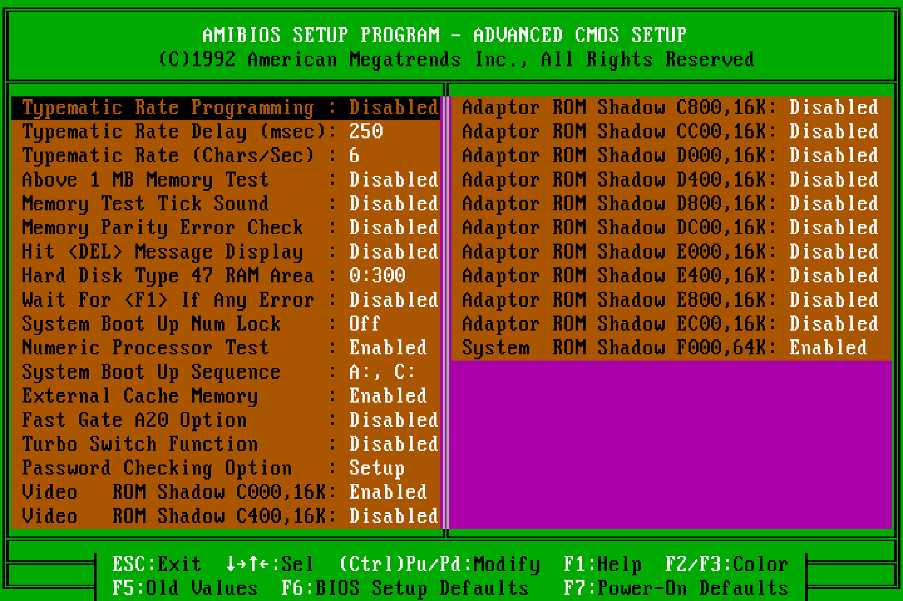
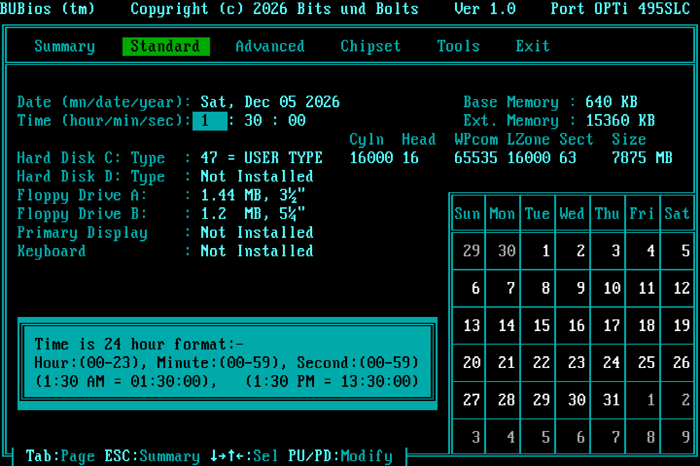

# BUBios

BUBios is a rebuilt version of the AMI BIOS (11/11/92) of the **SOYO SY-019L1** 386 board (OPTi 82C495SLC). AMI's POST and hardware code still do the work; BUBios replaces what you see and adds what the 1992 BIOS could not do:

- **Large disks:** LBA through the INT 13h extensions (EDD 1.1, 28-bit, up to **128 GB**), on top of the ECHS translation from the [root project](../README.md) (up to 8.4 GB through classic CHS)
- **Automatic IDE detection** at every boot, and unplugged drives dropped instead of stalling POST
- **A full-screen POST display**: live memory test, disk model names and geometry, ports, option ROMs, and a 3-second boot countdown with DEL for setup
- **A new setup program** in the style of MR BIOS: tabs, a Summary page, typed date and time, six colour schemes
- **A fix for MS-DOS missing floppy swaps** when a CF card is on the IDE bus

All of it fits in the original 64 KB EPROM (27C512). Dead AMI code was removed to make room.

**Status: complete, and confirmed on the real board.** The current version is **2.1**. The seventh build (the release, MD5 `b975393064d7b8a387dd7bf6e5d32286`, in the git history) was tested with 16 and 64 MB RAM, a 20 GB master and an 80 GB Samsung (auto-detect, LBA), 4 GB and 16 GB CF cards, and Windows 95 B / MS-DOS 7.1. The eighth build in `binary/` adds only the `CF` badge on the POST screen and still has to be confirmed on the board; everything else in this README runs on the board.

| | |
|---|---|
| ROM image | `binary/BUBIOS2_SY019L1.BIN` (64 KB, 27C512) |
| MD5 | `d5894024e3665d4a426e5b7cdb47a87c` (eighth build) |
| Built from | `binary/base/SY019L1_27C512_CHSPATCH.BIN` (ECHS v5, MD5 `8e520e91100f932d3f054883b08d37da`) |
| Version shown | 2.1 (setup title bar, Summary page, POST screen) |

*The "2" in the file name is historical. There is only one BUBios; its version history is in [CHANGELOG.md](CHANGELOG.md).*

> **No recovery block.** This BIOS generation cannot recover from a bad ROM. Keep the original chip, or at least the original dump (`binary/base/SY019L1_27C512_ORIGINAL.BIN`, MD5 `e80a824d8f3c39d40b98a4be5d8d9cff`), before you program an EPROM.


## Contents

- [Using the ROM](#using-the-rom)
- [The setup program](#the-setup-program)
- [The POST screen](#the-post-screen)
- [The boot countdown](#the-boot-countdown)
- [Automatic hard disk detection](#automatic-hard-disk-detection)
- [LBA: INT 13h extensions](#lba-int-13h-extensions-edd-11)
- [Floppy disk change with CF cards](#floppy-disk-change-in-ms-dos-cf-cards-hide-it)
- [How it works](#how-it-works)
- [Dead code removed and ROM space](#dead-code-removed-and-rom-space)
- [Build and test](#build-and-test)
- [Known limits](#known-limits)
- [Picking this up again](#picking-this-up-again)
- [Files](#files)

## Using the ROM

1. Program `binary/BUBIOS2_SY019L1.BIN` into a 27C512 EPROM.
2. In setup, either enter each drive's **physical** geometry as type 47 (the Tools page's *Auto-Detect Hard Disk* fills it in), or switch on **Auto-Detect Disks at Boot** on the Tools page and let POST do it at every boot.
3. The BIOS shows DOS a translated (ECHS) geometry of up to 1024/255/63 (8.4 GB). LBA-aware systems (MS-DOS 7.1, Windows 95 OSR2/98) reach the rest of the disk, up to 128 GB, through the INT 13h extensions.
4. Disks partitioned under the ECHS ROM keep exactly the same geometry and stay readable. Disks partitioned under another BIOS or translation scheme must be repartitioned.
5. DOS FAT16 partitions are limited to 2 GB. Use several partitions, or MS-DOS 7.1 / Windows 9x with FAT32.

Changing a drive's type-47 geometry later changes its translated geometry, so existing partitions would no longer be readable.

## The setup program

| Original AMI setup | BUBios |
|---|---|
|  |  |

*The setup screenshots in this folder are rendered by the setup emulator (see [Build and test](#build-and-test)), which is set up to match the test board: 386DX-40 with a coprocessor.*

Six tabs: **Summary · Standard · Advanced · Chipset · Tools · Exit**

| Tab | Contents |
|---|---|
| Summary | Read-only overview, shown when you enter setup (details below) |
| Standard | AMI's Standard CMOS page: date, time, drives, floppies, display |
| Advanced | AMI's Advanced CMOS page: boot, cache, shadow, typematic, password mode |
| Chipset | AMI's OPTi chipset page |
| Tools | Load BIOS defaults, load power-on defaults, change password, auto-detect hard disk, **Auto-Detect Disks at Boot: Off/On** |
| Exit | Save settings and exit, exit without saving |

The Summary page shows:

- CPU type (386 or 486, or the CPUID family on newer CPUs; Cyrix 486DLC-class cores are named as such)
- Measured CPU clock
- Math coprocessor (probed directly with FNINIT)
- Chipset
- Base, extended and total memory
- External cache, video shadow and system shadow
- BIOS core and BUBios version
- Floppy A: and B:
- Each hard disk as a group: a size row (`7875 MB [47]`), then the physical CHS (`├─ Physical 16000/16/63`) and the geometry DOS sees through ECHS (`└─ DOS (ECHS) 1002/255/63`). Small disks show "not needed" in the DOS row.
- Boot sequence, NumLock, password check and video type

**Keys**

| Where | Key | Action |
|---|---|---|
| Everywhere | Tab / Shift-Tab | Next / previous tab (the only keys that switch tabs) |
| Summary / Tools / Exit | ←/→ | Nothing (arrows never switch tabs) |
| | ↑/↓ | Select an entry |
| | Enter | Run the selected entry |
| | ESC | Go to Summary (ESC on Summary goes to Exit) |
| | F10 | Save and exit |
| | F2/F3 | Change the colour scheme |
| Standard / Advanced / Chipset | Arrows, PgUp/PgDn | Move between fields and change values, as in AMI |
| | ESC | Back to Summary |
| Standard, date/time fields | 0-9 | Type the value. The field accepts it when full (4 digits for the year); Enter or an arrow accepts a shorter entry, Backspace deletes, ESC cancels. A two-digit year means 1980–2079. Invalid values, such as month 13, are ignored. |

**Colour schemes** (F2/F3 cycles through them, and the choice is saved in CMOS like AMI's own): teal (the MR look, with a green active tab), amber, green phosphor, classic blue, grey, and the original AMI colours. The POST screen uses the same scheme.

**Left out of the menu:** AMI's "Improper use of setup" warning screen, and the low-level **Hard Disk Utility** (format, interleave, media analysis, bad-track editor). The utility can destroy data and is meaningless on IDE and CF drives. Its code has since been removed from the ROM (see [Dead code removed](#dead-code-removed-and-rom-space)).

| | |
|---|---|
|  |  |
| Original AMI Advanced CMOS page | The same page in BUBios |
|  |  |
| Tools page | Typing the hour on the Standard page |

## The POST screen

| | |
|---|---|
|  |  |
| The video BIOS sign-on stays for 2 s | Memory test: the fields are already filled in |
|  |  |
| Error messages (a cleared CMOS, blue scheme) | Auto-detect on, a 19.6 GB disk not entered in CMOS |
|  |  |
| Amber scheme | Monochrome (MDA) |

*The POST screenshots were taken in 86Box on its OPTi 495 machine with this ROM installed. That is why the disk is called "86B_HD00" and why POST takes about 14 s there.*

The video card's own sign-on stays on screen for 2 s before the POST screen is drawn; if the card prints nothing, POST does not wait. Everything that can be known before the memory test is shown with the first screen. What cannot be known yet shows `...` until it is.

| Area | Contents | Filled in |
|---|---|---|
| Title bar | BUBios 2.1, Power-On Self Test | at once |
| Processor | 80386 / 80486 / CPUID family; Cyrix 486DLC-class cores are named as such | at once |
| Coprocessor | 387 present / On-chip / None (FNINIT probe) | end of POST, when interrupts and AMI's IRQ 13 handler are set up; `...` until then |
| Clock | measured CPU clock (PIT-timed DIV loop, as on the setup's Summary page, but with 32 DIVs per pass so that slow uncached code fetches early in POST hardly matter) | at once if the reading is within 1/16 of a standard clock; otherwise tried again after the memory test and at the end of POST. `...` until then |
| Cache | external cache size as the OPTi chipset reports it, or Disabled | end of POST (AMI sizes and enables the cache last); `...` until then |
| Shadow RAM, RTC battery | from CMOS | at once |
| Memory | progress bar and count in KB, updated for every 64 KB block AMI tests. Below 1 MB only the count runs; the bar starts when AMI reports the total above 1 MB (the size in CMOS may still be from before a RAM upgrade) | live |
| Floppy A:/B: | drive types from CMOS | at once |
| Disk C:/D: | model name read from the drive (IDENTIFY), LBA size if larger than CHS, drive type (or Auto), physical geometry, the geometry DOS sees through ECHS, size in MB. A CompactFlash card gets a ` CF ` badge in the title-bar colours between the label and the model name (see [Floppy disk change](#floppy-disk-change-in-ms-dos-cf-cards-hide-it)) | at once; a drive that is still spinning up shows `...` and is identified after the memory test |
| Ports | COM1-4 and LPT1-3 with their I/O addresses | at once: BUBios probes the ports the same way AMI does at checkpoint 9Ah (UART IIR at 3F8/2F8/3E8/2E8, printer data latch at 3BC/378/278). AMI repeats it later and the list is redrawn from its result. `None` only at the end |
| Option ROMs | every ROM found between C000 and EFFF, with its size | at once |
| Message rows | AMI's error messages in red, then the countdown | when needed |
| Status bar | what POST is doing: *Press DEL to run Setup*, *Entering Setup*, *Checking devices*, *POST found a problem*, and at the end the boot order and how long POST took. On the right, the AMI BIOS ID string, ending in column 78 like the title bar (the last column is often hidden by the monitor's overscan) | live |

- The end-of-POST beep is replaced by a two-note chime.
- POST itself is not changed: the sequence of POST checkpoint codes is identical to BUBios 1.0, which only changed the setup.
- The screen uses the colour scheme selected in setup. On a monochrome adapter it uses mono attributes.
- Just before the boot, the video mode is set again, so DOS starts on a clear screen with normal grey-on-black text and the cursor at the top left.
- AMI's "(C) American Megatrends Inc.," line is not shown. AMI's POST had a tamper check that crashed on purpose without it; BUBios switches that check off (see [How it works](#amis-copyright-check)). The AMI copyright text in the ROM is left untouched.

## The boot countdown

At the end of POST the screen shows:

`Press DEL to run Setup, any other key to boot now ... 3`

The number counts down once a second. The timing comes from the DRAM refresh signal, so it is the same at any CPU clock.

- **DEL** runs the setup, after the password prompt if a password is set.
  - If nothing changed, the boot continues at once.
  - If something changed, the machine restarts so that POST applies it from the start: drive types, cache, shadow, the auto-detect switch and everything else. Changing the switch on the Tools page counts even if you then leave setup without saving, because the switch takes effect at once.
  - To find changes, BUBios compares AMI's two CMOS checksums (10h-2Dh and 34h-6Eh) and the auto-detect switch (7Eh/7Fh) before and after setup. Date and time live in the clock chip and need no restart.
- **Any other key** boots at once.
- With no key, it boots after 3 seconds.

DEL works at any time from the memory test to the end of the countdown. During the memory test, AMI catches it; after that, BUBios does. As soon as DEL has been seen, the status line changes to **Entering Setup** (AMI's DEL flag is CMOS 0Eh bit 0).

AMI's own "Hit DEL" during the memory test still works as before. There, POST simply carries on after setup. The disks are set up later in POST, so saved changes apply without a restart. When setup returns, BUBios asks the drives again: the names come back, and a drive is auto-detected if you just switched auto-detect on.

## Automatic hard disk detection

This is an entry on the setup's **Tools** page: **Auto-Detect Disks at Boot: Off/On**. Press Enter to switch it. It takes effect at once, like the password.

When it is **On**, POST sends IDENTIFY to the master and the slave at every boot. If a drive answers, POST checks the drive-type settings:

- If they are missing or differ from what the drive reports, POST writes them to CMOS as type 47 with the drive's own geometry and fixes the CMOS checksum.
- It does this before AMI sets up the disks, so the drive can be used in the same boot.
- The POST screen says **Auto** instead of **Type 47** for such drives.
- A drive that has spun down (or a CF card) is waited for, up to 10 s, after the memory test.

When it is **Off** (the default), the drive types come from the Standard page as before. The POST screen still asks each configured drive for its name.

**A drive that is set up but not connected** (auto-detect on or off) is dropped:

- Its type in CMOS becomes "not installed" (with a new checksum) after the memory test, before AMI sets up the disks.
- AMI would otherwise wait for it for about a minute and then stop with *HDD controller failure / Press F1*.
- A drive counts as not connected only if nothing answers on the bus at all (status FFh, 00h or 7Fh) after the memory test. A drive that is still spinning up answers "busy" and is waited for as before.
- Before that, the model row shows `...`.

The switch is stored in CMOS 7Fh, with a check byte in 7Eh. A cleared or random CMOS reads as Off.

## LBA: INT 13h extensions (EDD 1.1)

INT 13h functions 41h, 42h, 43h, 44h, 47h and 48h are added for hard disks, in the standard form ("fixed disk access subset", EDD 1.1):

| AH | Function |
|---|---|
| 41h | Installation check: BX = AA55h, AH = 21h, CX = 1 |
| 42h / 43h | Read / write up to 127 sectors at a 64-bit LBA address from a disk address packet. The limit is 28 bits, which is 128 GB. |
| 44h | Verify sectors |
| 47h | Seek: accepted, no action (IDE drives seek on their own) |
| 48h | Drive parameters: physical geometry and the total number of sectors (IDENTIFY words 60-61) |

A request that lies completely inside the drive's CHS geometry is sent in CHS form, so drives without LBA work too. A request beyond that uses LBA addressing.

**The `LBA nnnn MB` note on the POST screen** appears on a drive's name row only when the drive has more sectors through LBA than through its CHS geometry. Most drives above 8.4 GB report 16383/16/63, so the rest is LBA-only, as with the 80 GB Samsung (`LBA 76293 MB`). Some CF cards report their full size as CHS instead: the 16 GB card reports 31045/16/63, which is legal in ATA, where cylinders go up to 65535. For such a card, CHS and LBA sizes are the same and there is no LBA note. The whole card is still reached the same way:

- DOS 7.1 asks for sectors by LBA number through the INT 13h extensions.
- BUBios passes them to the card as CHS addresses, because they lie inside its CHS geometry.
- The old INT 13h CHS interface (1024/255/63, 8 GB) is only used for the boot and for FAT partitions of the pre-LBA types.

**What does not change:**

- The classic CHS functions (02h, 03h, 08h …) and the ECHS translation are untouched. DOS sees the same 1002/255/63 geometry as before, and existing partitions and installations are not affected.
- `regress_echs.py` passes unchanged.

**What LBA adds:**

- MS-DOS 7.1 (Windows 95 OSR2/98) and other LBA-aware systems use the extensions for partitions of type 0Ch/0Eh/0Fh (FAT32 LBA, FAT16 LBA, extended LBA).
- On a disk larger than 8.4 GB, FDISK can see and use the whole disk, up to 128 GB with 28-bit LBA.

## Floppy disk change in MS-DOS: CF cards hide it

**Symptom (on the board, MS-DOS 7.1):** after a floppy swap, `DIR A:` still lists the old disk. It happens with a TEAC drive and a GoTek. Taking the disk out (a read error) or Ctrl+C makes DOS read it again.

**Result:** tested with `tools/DSKCHG.COM`:

| On the IDE bus | Change line (3F7h bit 7) |
|---|---|
| a CF card, set up in BIOS or not, even with nothing configured | **never** seen |
| the CF adapter alone, no card | seen at once |
| Seagate or WD hard disk | seen at once |

Windows 95 was fine only because it was installed on a hard disk.

**Why:** port 3F7h is shared on the ISA I/O card.

- The floppy controller supplies bit 7 of it, the disk-change line from pin 34.
- The IDE side decodes the same address as the drive's "Drive Address" register.
- The ATA standard says a drive must leave bit 7 of that register alone. Hard disks do; the CF card drives it and wipes out the change line.
- MS-DOS then asks the BIOS (INT 13h AH=16h), gets "not changed" and keeps its cached directory.

It is not a BIOS fault:

- AMI's floppy code is byte-identical in the original, ECHS and BUBios ROMs (INT 40h handler at `EC59`; FDC routines at `8878`, `89FC`, `940C-97D4`, `C5F2`).
- In the emulator, INT 13h 15h/16h answer exactly like the original ROM. `test_post.py` checks them.

**What BUBios does: no change line while a CF card is present** (confirmed on the board: the directory updates after a swap).

- At POST, BUBios recognises a CompactFlash card from its IDENTIFY data: word 83 bit 2 (CFA feature set) or word 0 = 848Ah.
- The POST screen marks the card with a ` CF ` badge on its model row (`Disk C:  CF  SanDisk SDCFB-8192`, in the title-bar colours, inverse on a monochrome adapter). The badge means: this is a CF card, so the floppy change line is switched off. A hard disk gets no badge.
- At the end of POST it sets a flag (bit 3 of 40:8Fh, a bit AMI never uses).
- AMI's INT 13h AH=15h asks a stub routine (`D385`, STC/RET) whether a floppy's change line can be used. BUBios points that call at `cf_chgline`, which answers "no" when the flag is set, so AH=15h returns AH=01 (drive without change line).
- DOS then does what it always did for drives without a change line: after 2 seconds without access it reads the boot sector again and compares the volume serial number, so a swapped disk is noticed.
- With hard disks only, nothing changes (AH=02; the fast change line is used).
- **Limits:**
  - Two disks with the same serial number (copies of one image) still look alike to DOS.
  - A CF card that is neither set up nor found by auto-detect is not asked for IDENTIFY, so it is not recognised (and has no badge).
  - A card that reports neither signature is not recognised either.
  - In both cases, add `DRIVPARM=/D:0 /F:7` to CONFIG.SYS. It does the same by hand: `/F:7` means a 1.44 MB drive, and the missing `/C` means "no change line".
- Selecting a different IDE device before reading 3F7h does not help: the S key in `DSKCHG` never made the line appear.

**Why not simply answer "changed" every time?**

- DOS would throw away its cached FAT and directory on every access. Worse, a disk it thinks was swapped while it still has unwritten buffers for it leads to *Invalid disk change* errors, or lost data, in the middle of a copy.
- "No change line" is the mode DOS was built for (the 360 KB drives of the PC and XT had no change line). DOS then decides itself when to look again, and it never does so while it has data to write.

**`tools/DSKCHG.COM`** (source `tools/dskchg.asm`, 408 bytes, runs under DOS):

- It shows INT 13h 15h/16h, the raw 3F7h byte and its bit 7 several times a second.
- Keys **M**, **S** and **N** select the IDE master, the IDE slave or neither before the read.
- **Esc** quits.

## How it works

BUBios never changes the order of POST or what POST tests, and it leaves AMI's setup pages running as they are. It replaces a few routines outright (the setup's main menu and screen header) and otherwise hooks the places where AMI prints something, replacing the print or wrapping it. Every hook is a same-length `CALL` or `JMP` into new code, padded with `NOP`s, so no other AMI code moves. [`docs/BIOS_ADDRESS_MAP.md`](../docs/BIOS_ADDRESS_MAP.md) §9 lists every address in one place.

### Setup

AMI's setup program is table-driven, and it draws all its screens through one header routine (`38B5`). BUBios replaces two routines: the main menu (`36D4`) and that header. Everything else is AMI's own code. The Standard, Advanced and Chipset pages, the password, auto-detect, defaults and the Y/N dialogs all run unchanged. The Summary page prints AMI's own option records, so the text of each value always matches the Advanced page.

| Site | Change |
|---|---|
| `36D4` | `JMP bu_main`: tab bar, Summary, Tools and Exit pages |
| `38B5` | `JMP bu_hdr`: title bar, frame, tabs, footer |
| `0D3D` | `CALL bu_edkey`: Tab/Shift-Tab inside the Advanced and Chipset editor |
| `08D5` | `CALL bu_stdkey` + `NOP`: Tab/Shift-Tab inside Standard CMOS, and digits in date/time fields |
| `5F94` | `CALL bu_dtkey`: marks which date/time field is active, for number entry |
| `5037` | 16 colour schemes |
| `4FF6` | "bright" mask `0Fh` → `08h`, so highlighted values stay teal instead of turning white |
| `309A`, `6D3A` | Footer texts now mention Tab and ESC |
| `2ECE` | The old main menu's Hard Disk Utility entry points at a `RET` |

- **The clock measurement:** the CPU runs 2000 × (8 × `DIV r16` + `LOOP`) from the setup's RAM copy, timed with PIT channel 2. The result is snapped to the nearest standard clock within 6 %. The cycle counts behind it are 190 per loop on a 386, 199 on a 486 and 206 on a Pentium. For other CPUs, the per-family cycle counts are in `clock_k`.
- **Date/time entry:** AMI edits the date and time directly in the real-time clock (RTC). A typed value goes through AMI's own routines: set date at `5FCB` (which keeps the day valid for the month) or INT 1Ah AH=03h, then redraw at `6022`. While you type, AMI's once-a-second clock redraw is paused so it doesn't overwrite your digits.
- **Why the setup's code and data are split:** setup copies F000:0000-DFFF to segment 0100h and runs with DS=0100h. Anything the setup reads through DS (strings and tables) must therefore sit below E000h. It also must not sit in DA84-DFFF, because the setup uses that area of the RAM copy as its stack. So the code goes in DA84 (executed from F000) and the data goes in 7902. The date/time entry code uses two more small free blocks, 7F14-7FFF and 7856-78FF.
- **Total memory** is added in 32 bits: with 64 MB, 64512 + 1024 KB would wrap to 0 in 16 bits.

### POST

AMI's POST prints through a handful of routines. BUBios replaces those prints or wraps them.

| Site | Original | Now |
|---|---|---|
| `593B`, `12BF` | logo line `AMIBIOS (C)1992 …` | nothing |
| `5945`, `12C6` | `CALL F42E` (BIOS ID lines) | `bu_post_init`: leaves the video BIOS sign-on up for 2 s, calls F42E (it also sets the A20 gate), draws the screen and identifies the disks (and sets them up if auto-detect is on) |
| `4F04` | "Hit <DEL>, If you want to run SETUP" | `bu_delmsg`: status line |
| `4EA1` | memory count `nnnnnn KB OK` | `bu_memshow`: bar and count (the 40 bytes jumped over, 4EAA-4ED1, now hold code) |
| `4CB4`, `12CD` | `WAIT......` | `bu_wait`: status line; identifies drives that were not ready yet (up to 10 s with auto-detect) |
| `120D`, `158C` | AMI's error list | `bu_errors`: clears the message rows, then AMI's list |
| `1610` | end-of-POST beep | `bu_chime` |
| `1613` | clear screen before the configuration box | `bu_refresh`: only if the POST screen is not intact (after setup), the mode is reset and the screen redrawn |
| `164C` | configuration box | `bu_final`: clock, cache, ports, boot order, POST time, countdown, then a clean screen for DOS |
| `A3E7` | INT 13h entry | `bu_int13`: AH 41h-48h for hard disks go to the extensions, everything else to AMI/ECHS as before |
| `C6E4` | INT 13h AH=15h (floppy): `CALL D385` (stub, "change line usable") | `cf_chgline`: "no" when a CF card is on the IDE bus |
| `F3DB` | copyright check | `RET` |

Notes for anyone changing this code:

- **The memory count runs after a CPU reset.** AMI tests memory in protected mode. For every 64 KB block it resets the CPU back to real mode to print the count. `bu_memshow` is called at that point with AX = blocks counted and DX = blocks left. BP = 1, 0Ah or 10h tells it which pass is running.
- **State between the hooks** is kept in the BDA inter-application area `40:F0-40:FF`, which nothing else uses during POST. `bu_final` clears it before the boot.
- **After IDENTIFY, the master is selected again.** If a missing slave stays selected, AMI's disk setup at checkpoint 91h hangs. The emulator found this bug before any chip was burned.
- **The restart after setup** is a keyboard-controller reset with CMOS shutdown code 0. AMI's chipset setup at checkpoint 05h turns the shadow RAM off again, so the EPROM is checksummed afresh. 86Box confirms the restart.
- **Interrupts stay off.** AMI runs the early part of POST with interrupts off, and on a cold start the interrupt controllers are not set up yet. Nothing in the POST screen code may turn them on: `measure_clock` saves and restores the flag. An STI there caused the occasional hang at power-on or RESET seen with the fourth build.
- **The clock**: the timing loop (500 passes of 32 × `DIV BX` + `LOOP`) is built at `0:7C00` so that it runs from RAM, and timed with PIT channel 2. The constants are the setup's per-instruction timings (386: DIV r16 22 clocks, LOOP 13). The setup itself still uses its 8-DIV loop, where the cache is always on.
- **Absent drives are only final after the memory test.** Before that, a drive may simply not have spun up yet.

### AMI's copyright check

AMI's POST has a tamper check. At checkpoints 40h, 60h and 95h, routine `F3DB` reads text row 21, columns 0-28. If that text is not `(C) American Megatrends Inc.,`, POST jumps into a deliberately unbalanced RET and crashes. With a valid CMOS the check is skipped, which is why it only showed up with a cleared CMOS.

The check detects nothing about the hardware. It only makes sure that the copyright notice is displayed. In BUBios the first byte of `F3DB` is a RET, so the check does nothing and the POST screen no longer carries the line. The test with a cleared CMOS (errors, F1, setup, boot) passes without it. The AMI copyright text in the ROM is left untouched, as is the ROM's own integrity check (`F419`).

## Dead code removed and ROM space

Four pieces of AMI code can no longer be reached. Their space was cleared (4,501 bytes in total):

| Range | Size | What it was | Why it is dead | Used for now |
|---|---|---|---|---|
| `39C0-3B83`, `3B8F-4033` | 1,641 B | AMI's "System Configuration" box, including its texts | replaced by the POST screen | POST screen |
| `4034-4167`, `429D-49DA` | 2,162 B | Hard Disk Utility: low-level format, auto interleave, media analysis, bad-track editor | not in the BUBios menu; format and interleave are meaningless on IDE and CF | POST screen, IDENTIFY, auto-detect |
| `3292-3481` | 496 B | Hard Disk Utility texts | as above | INT 13h extensions |
| `19B0-1A79` | 202 B | cache and CPU-clock lines printed under the configuration box | only called by the box | Tools switch |

These routines lie between or beside those ranges and are kept:

- the CR/LF routine at `3B84-3B8E`
- the drive-information display at `4168-429C`, used by the setup's auto-detect
- the error dialog at `49DB-4A43`
- the error and auto-detect texts at `3482-36D3`

The last entry of AMI's old main-menu handler table (`2ECE`) pointed at the Hard Disk Utility. It now points at a RET.

The dead code was found in three steps:

1. **Recursive disassembly** from the utility's entry point, its two internal jump tables (`332F`, `33B3`) and from every live entry point.
2. **Reference search.** Every CALL and JMP in the ROM was checked for references into the ranges.
3. **Execution check.** All test suites were run with a watch on the removed ranges.

The build script checks the MD5 of every removed range before clearing it, and of every kept neighbour after patching.

**All the space BUBios uses** (`py/build_bubios.py` prints how full each block is):

| Block | Range | Contents |
|---|---|---|
| `code` | `DA84-DFFF` | setup code (free space in the original ROM) |
| `data` | `7902-7EFD` | setup strings and tables; the ROM checksum word is `7EFE` |
| `code2`, `code3` | `7F14-7FFF`, `7856-78FF` | date/time entry |
| `post1`, `post2`, `post3` | `39C0-3B83`, `3B8F-4167`, `429D-49DA` | POST screen, IDENTIFY, auto-detect |
| `lba` | `3292-3481` | INT 13h extensions |
| `tools` | `19B0-1A79` | Tools switch |
| `mem` | `4EAA-4ED1` | the 40 bytes of AMI's old memory-count print that are jumped over |
| `wait` | `76AC-76B8` | AMI's unused "WAIT......" text |

**Space left:** about 13 bytes, in small gaps.

## Build and test

Run these from this folder. You need NASM, Python 3 and `pip install unicorn pillow`. The folder is self-contained: `binary/base/` holds copies of the original and ECHS ROMs, and `py/` holds copies of the ECHS emulator and tests.

```
python3 py/build_bubios.py     # builds binary/BUBIOS2_SY019L1.BIN from binary/base/ and prints its MD5
python3 py/test_bubios.py      # 74 checks of the setup
python3 py/test_post.py        # 97 checks of POST, countdown, setup visits, auto-detect, LBA, floppy change line (25-35 minutes)
python3 py/regress_echs.py     # ECHS INT 13h regression + INT 19h boot test on this ROM
python3 py/shots.py            # setup screenshots into shots/
nasm -f bin tools/dskchg.asm -o tools/DSKCHG.COM      # the DOS change-line tester (byte-identical)
nasm -f bin asm/lba_test_mbr.asm -o lba_test_mbr.bin  # the LBA test boot sector (scratch disks only)
```

`shots.py` rewrites the PNGs even when nothing changed on screen (the PNG encoding depends on the Pillow version); check the difference before committing them.

**Build checks.** `build_bubios.py` checks the MD5 of the input ROM, the original bytes at every patch site, every AMI string and option record it reuses, the MD5 of every dead-code range before clearing it and of every kept neighbour afterwards, that every free block is empty, that the code and data fit their blocks, and the final checksum.

**Emulators:**

- **`setup_emu.py`** enters the ROM's real setup the way POST does (F000:2968) in Unicorn. It emulates INT 10h and text video memory, scripts INT 16h keystrokes, emulates the CMOS, and models PIT channel 2 for the clock measurement. It saves the 80×25 screen as a PNG, using the IBM VGA 9×16 font from VileR's Oldschool PC Font Pack (CC BY-SA 4.0, in `vgafont.py`).
- **`post_emu.py`** runs the complete POST from the reset vector in Unicorn. It models:
  - the PICs, PIT, keyboard controller (including the CPU reset), DMA, RTC/CMOS and the OPTi index ports
  - the floppy controller (including the change line, DIR bit 7 of port 3F7h), and master and slave IDE drives with IDENTIFY, CHS and LBA addressing, reads, writes and errors
  - serial and parallel ports
  - a colour VGA or a monochrome adapter
- **`int13x.py`** runs single INT 13h calls on the emulated machine after POST.
- **`ide_harness.py`**, **`regress.py`**, **`boot_test.py`** are copies of the ECHS tools from the repository root; `regress_echs.py` runs them against this ROM.

**Automated tests:**

- `test_bubios.py` (74 checks):
  - the Summary contents for five drive geometries, and 64 MB total memory
  - every tab transition, and that the arrow keys do not switch tabs
  - editing a value and seeing it on the Summary page
  - F10 + Y writing CMOS with a valid checksum, and quitting without saving leaving CMOS untouched
  - colour cycling and loading defaults
  - typing the date and time: full fields, 2-digit years, invalid values, Backspace, ESC, and committing with Tab or an arrow key
  - the Tools page's auto-detect switch and its CMOS bytes
- `test_post.py` (97 checks):
  - the screen in the normal case, and the early fields during the memory test
  - the countdown: 3 s, any key boots, DEL runs setup, a save restarts POST, setup visits before and during the countdown
  - the cleared screen and normal colours for DOS
  - memory sizes of 4 to 64 MB, the memory bar after a RAM upgrade, no disk, master plus slave, a small ROM-table drive
  - auto-detect with no CMOS entries and with wrong ones
  - a cleared CMOS without the copyright line, including F1 into setup
  - that the interrupt flag is still off after the POST screen's early work
  - the colour schemes, monochrome and the chime
  - the INT 13h extensions: 41h, 48h, 42h and 43h above 8.4 GB, read-back, verify, seek, errors (past the end of the disk, more than 127 sectors, a missing drive), and the classic CHS read and AH=08h, unchanged
  - the floppy change line through INT 13h 15h/16h with a hard disk, a CF master and a CF slave, and the ` CF ` badge on the card's row (none for a hard disk)
  - that the POST checkpoint sequence is identical to BUBios 1.0 (the setup-only version). This one check needs the 1.0 ROM, which is no longer in the repository, and is skipped without it. To run it, restore the ROM from git history: `git show 0ccbeb2:BUBios/binary/BUBIOS_SY019L1.BIN > binary/BUBIOS_SY019L1.BIN` (MD5 `087565a6ba5e86a058275965c6bdca60`).
- `regress_echs.py`: all 10 ECHS geometries and all 5 INT 19h boot cases pass, exactly as with the ECHS ROM.

**86Box** (v6.0, machine *[OPTi 495] DataExpert OPTi-495SX*, with `roms/machines/ami495/opt495sx.ami` replaced by this ROM) ran the full POST on an emulated 386DX-40 with a 387, a Tseng ET4000 or MDA card and an IDE disk. It confirmed:

- the ET4000 sign-on
- the 40.0 MHz clock reading
- the countdown, and DEL → setup → F10 → restart
- auto-detect of a 19.6 GB disk (38000/16/63) that was not in CMOS

**`asm/lba_test_mbr.asm`** is a boot sector that calls 41h, 48h, 42h, 43h, 02h and 08h and prints the results. In 86Box, on the 19.6 GB disk, all calls returned OK. The sector written through 43h was found in the disk image at LBA 30,000,001. Use it only on a scratch disk: it overwrites the MBR.


## Known limits

- The POST time uses the RTC, so its resolution is one second. It is not shown after a visit to setup (it would include the time spent there).
- The clock constants are calibrated for Intel/AMD 386 and 486 cores. A Cyrix 486DLC-class CPU is detected and named, but its clock reading may be off until it is calibrated on a real chip.
- Option ROMs that print during POST (for example a network boot ROM) print wherever the cursor is.
- The INT 13h extensions use 28-bit LBA (up to 128 GB). They do not provide the EDD 3.0 device path, or the 49h/4Eh functions.
- With auto-detect on, a drive is set up with the geometry it reports (16383/16/63 for most drives above 8.4 GB, 31045/16/63 for the 16 GB CF card). Through CHS/ECHS, DOS sees at most 8,063 MB (1024/255/63), as with any BIOS of this kind. The rest is reachable through the INT 13h extensions.

## Picking this up again

The project is complete. All reported bugs are closed and confirmed on the board with the seventh build of 2.1 (see [CHANGELOG.md](CHANGELOG.md)). The eighth build only adds the `CF` badge; confirm it on the board with a CF card and with a hard disk only.

- **Space:** the ROM is practically full (about 13 bytes left in small gaps; `py/build_bubios.py` prints them). New features need space reclaimed first. Candidates: AMI texts that are no longer printed (check every reference, including `push imm16`), and repeated instruction sequences in BUBios's own code that can become a helper (the eighth build found 21 bytes that way in `fill_values`).
- **Testing:** `py/test_post.py` takes 25-35 minutes. Stop any stray 86Box processes first; they slow it down a lot.
- **Traps** (details in [How it works](#how-it-works)):
  - interrupts are off in early POST
  - absent drives are only final after the memory test
  - AMI's DEL flag lives in CMOS 0Eh bit 0
- **Porting to another BIOS:** [`docs/BIOS_MODDING_GUIDE.md`](../docs/BIOS_MODDING_GUIDE.md) turns what was learned here into a method.

## Files

```
README.md, CHANGELOG.md     this file, version history
asm/
  bubios.asm                setup program (tabs, Summary, Tools, Exit, date/time entry); includes post.asm
  post.asm                  POST screen, countdown, auto-detect, INT 13h extensions, CF change-line fix
  bubios.lst, bubios.map    NASM listing and section map (regenerated by the build)
  lba_test_mbr.asm          boot sector that tests the INT 13h extensions
binary/
  BUBIOS2_SY019L1.BIN       the BUBios ROM (flash this)   MD5 d5894024e3665d4a426e5b7cdb47a87c
  base/                     copies of the original and ECHS ROMs the build starts from
py/
  build_bubios.py           assemble + patch + checksum -> binary/BUBIOS2_SY019L1.BIN
  setup_emu.py, vgafont.py  setup emulator and its screenshot font
  post_emu.py, int13x.py    full POST emulator, INT 13h calls after POST
  test_bubios.py            setup tests
  test_post.py              POST, countdown, auto-detect, LBA and floppy tests
  regress_echs.py           runs the ECHS regression and boot test on this ROM
  ide_harness.py, regress.py, boot_test.py   copies of the ECHS tools
  shots.py                  setup screenshots
shots/                      screenshots (0_original_* show the original AMI setup)
tools/
  DSKCHG.COM, dskchg.asm    DOS tool: floppy change line and port 3F7h live
```
