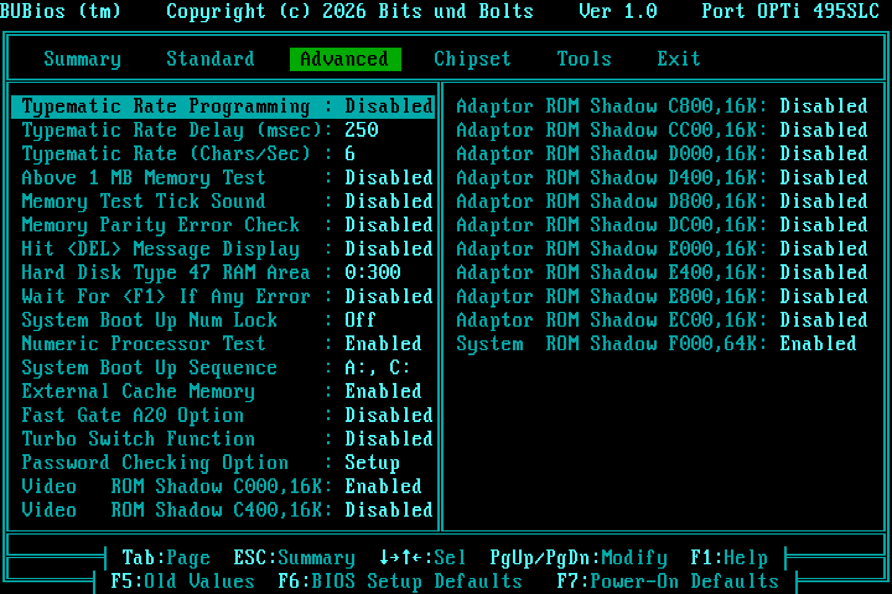
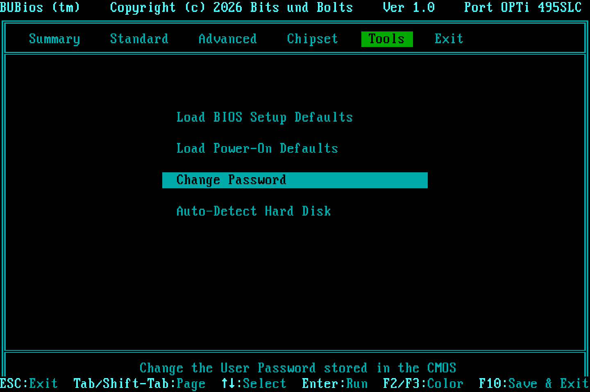

# BUBios 1.0

This is a new look for the setup program of the SOYO SY-019L1 BIOS, in the style of MR BIOS: a row of tabs across the top and a Summary page that opens first. It is built on top of the ECHS ROM from the parent project, which was confirmed on the real board. The disk code is not changed.

**Status:** trial 0.1 was tested on the real board. The Summary page, CPU type and CPU clock were confirmed there. Version 1.0 adds typing the date and time as numbers and the fixes from that test (see [CHANGELOG.md](CHANGELOG.md)); it has passed the emulator tests but has not been burned yet. Keep the ECHS EPROM (MD5 `8e520e91…`) as a fallback.

| | |
|---|---|
| ROM to burn | `binary/BUBIOS_SY019L1.BIN` (64 KB, 27C512) |
| MD5 | `087565a6ba5e86a058275965c6bdca60` |
| Based on | `../binary/SY019L1_27C512_CHSPATCH.BIN` (ECHS v5, MD5 `8e520e91100f932d3f054883b08d37da`) |
| New code / data | 1283 B at `DA84`, 1486 B at `7902`, 217 B at `7F14`, 158 B at `7856` (198 B left in these blocks) |
| Checksum word | `7EFE` (the whole 64 KB still sums to zero) |

## What you see


Six tabs: **Summary · Standard · Advanced · Chipset · Tools · Exit**

| Tab | Contents |
|---|---|
| Summary | Read-only overview, shown when you enter setup (details below) |
| Standard | AMI's Standard CMOS page: date, time, drives, floppies, display |
| Advanced | AMI's Advanced CMOS page: boot, cache, shadow, typematic, password mode |
| Chipset | AMI's OPTi chipset page |
| Tools | Load BIOS defaults, load power-on defaults, change password, auto-detect hard disk |
| Exit | Save settings and exit, exit without saving |

The Summary page shows:

- CPU type (386 or 486, or the CPUID family on newer CPUs)
- Measured CPU clock
- Math coprocessor (probed directly with FNINIT)
- Chipset
- Base, extended and total memory
- External cache, video shadow and system shadow
- BIOS core and BUBios version
- Floppy A: and B:
- Each hard disk as a group: a size row (`7875 MB [47]`), then the physical CHS (`├─ Physical 16000/16/63`) and the geometry DOS sees through ECHS (`└─ DOS (ECHS) 1002/255/63`). Small disks show "not needed" in the DOS row.
- Boot sequence, NumLock, password check and video type

**Keys**

| Where | Key | Action |
|---|---|---|
| Everywhere | Tab / Shift-Tab | Next / previous tab (the only keys that switch tabs) |
| Summary / Tools / Exit | ←/→ | Nothing (arrows never switch tabs) |
| | ↑/↓ | Select an entry |
| | Enter | Run the selected entry |
| | ESC | Go to Summary (ESC on Summary goes to Exit) |
| | F10 | Save and exit |
| | F2/F3 | Change the colour scheme |
| Standard / Advanced / Chipset | Arrows, PgUp/PgDn | Move between fields and change values, as in AMI |
| | ESC | Back to Summary |
| Standard, date/time fields | 0-9 | Type the value. The field accepts it when full (4 digits for the year); Enter or an arrow accepts a shorter entry, Backspace deletes, ESC cancels. A two-digit year means 1980–2079. |

**Colour schemes** (F2/F3 cycles through them, and the choice is saved in CMOS like AMI's own):

- Teal: the MR look, with a green active tab
- Amber
- Green phosphor
- Classic blue
- Grey
- Original AMI

## How it works (short version)

AMI's setup program is table-driven, and it draws all its screens through one header routine (`38B5`). BUBios replaces two routines: the main menu (`36D4`) and that header. Everything else is AMI's own code. The Standard, Advanced and Chipset pages, the password, auto-detect, defaults and the Y/N dialogs all run unchanged. The Summary page prints AMI's own option records, so the text of each value always matches the Advanced page.

| Site | Change |
|---|---|
| `36D4` | `JMP bu_main`: tab bar, Summary, Tools and Exit pages |
| `38B5` | `JMP bu_hdr`: title bar, frame, tabs, footer |
| `0D3D` | `CALL bu_edkey`: Tab/Shift-Tab inside the Advanced and Chipset editor |
| `08D5` | `CALL bu_stdkey` + `NOP`: Tab/Shift-Tab inside Standard CMOS, and digits in date/time fields |
| `5F94` | `CALL bu_dtkey`: marks which date/time field is active, for number entry |
| `5037` | 16 colour schemes |
| `4FF6` | "bright" mask `0Fh` → `08h`, so highlighted values stay teal instead of turning white |
| `309A`, `6D3A` | Footer texts now mention Tab and ESC |

**How the clock is measured:** the CPU runs 2000 × (8 × `DIV r16` + `LOOP`) from the setup's RAM copy, timed with PIT channel 2. The result is snapped to the nearest standard clock within 6 %. The cycle counts behind it are 190 per loop on a 386, 199 on a 486 and 206 on a Pentium. If the reading is off on your board, only the constant in `clock_k` needs changing.

**How date/time entry works:** AMI edits the date and time directly in the real-time clock (RTC). A typed value goes through AMI's own routines: set date at `5FCB` (which keeps the day valid for the month) or INT 1Ah AH=03h, then redraw at `6022`. While you type, AMI's once-a-second clock redraw is paused so it doesn't overwrite your digits.

**Why the code and data are split:** setup copies F000:0000-DFFF to segment 0100h and runs with DS=0100h. Anything the setup reads through DS (strings and tables) must therefore sit below E000h. It also must not sit in DA84-DFFF, because the setup uses that area of the RAM copy as its stack. So the code goes in DA84 (executed from F000) and the data goes in 7902. The date/time entry code uses two more small free blocks, 7F14-7FFF and 7856-78FF.

**Removed from the menu:** the AMI "Improper use of setup" warning screen, and the low-level **Hard Disk Utility** (format, interleave, media analysis). The utility can destroy data and is meaningless on IDE and CF drives. Its code is still in the ROM, and adding one list entry would bring it back.

## Build and test

Run these from this folder. You need NASM, Python 3, `pip install unicorn pillow`, and the parent repository around this folder.

```
python3 py/build_bubios.py     # builds binary/BUBIOS_SY019L1.BIN from the ECHS ROM
python3 py/test_bubios.py      # 67 behavioural checks of the setup in the emulator
python3 py/regress_echs.py     # parent ECHS INT 13h regression + INT 19h boot test on this ROM
python3 py/shots.py            # screenshots of every page into shots/
```

- **Build checks:** `build_bubios.py` checks the MD5 of the input ROM, the original bytes at every patch site, every AMI string and option record it reuses, that both free blocks are empty, that the code and data fit their blocks, and the final checksum.
- **Emulator:** `setup_emu.py` enters the ROM's real setup the way POST does (F000:2968) in Unicorn. It emulates INT 10h and text video memory, scripts INT 16h keystrokes, emulates the CMOS, and models PIT channel 2 for the clock measurement. It saves the 80×25 screen as a PNG, using the IBM VGA 9×16 font from VileR's Oldschool PC Font Pack (CC BY-SA 4.0).

**Test results (emulator):**

- `test_bubios.py`: 67/67 pass. It covers:
  - the Summary contents for five drive geometries
  - every tab transition, and that the arrow keys do not switch tabs
  - editing a value and seeing it on the Summary page
  - F10 + Y writing CMOS with a valid checksum, and quitting without saving leaving CMOS untouched
  - colour cycling and loading defaults
  - typing the date and time: full fields, 2-digit years, invalid values, Backspace, ESC, and committing with Tab or an arrow key
- `regress_echs.py`: all 10 ECHS geometries pass, and INT 19h boot passes for all 5 cases, exactly as with the ECHS ROM.

## Please check on the real board (1.0)

1. **Math Unit** shows "Present" with the Cyrix FasMath fitted.
2. **Typing the date and time**, including while the clock is ticking. The seconds must not overwrite your digits while you type.
3. The **arrow keys** on the Summary, Tools and Exit pages don't switch tabs.
4. **Save and exit**, then boot from the CF card.



