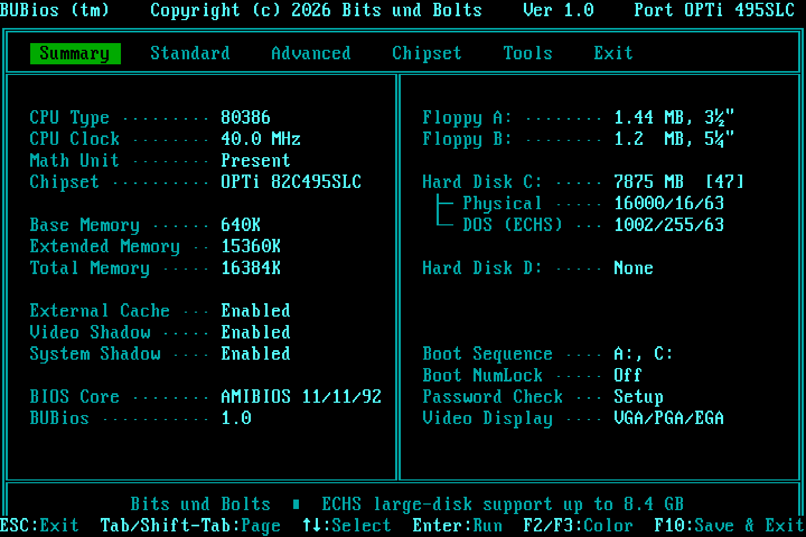

# SOYO SY-019L1 504 MB Patch

A patch for the AMI BIOS (11/11/92) of the **SOYO SY-019L1** 386 board
(OPTi 82C495SLC) that adds ECHS ("Large") CHS translation to the
hard-disk INT 13h handler. It lifts the 504 MB limit to the full INT 13h
CHS ceiling of **8.42 GB (7.84 GiB)**, with no LBA and without needing
more than the existing 64 KB EPROM (27C512).

**Status: complete, and confirmed on real hardware.** An 8 GB CF card
(16000/16/63 → 1002/255/63) partitions, formats, benchmarks and boots from
C:. `Project_Overview.md` lists all the tested drives.

On top of the patch, **[BUBios](BUBios/README.md)** gives the same BIOS a
new setup program in the style of MR BIOS:

- tabs across the top
- a Summary page with the CPU, measured clock, coprocessor, memory, and
  each disk's physical and ECHS geometry
- typing the date and time as numbers



**[BUBios 2.1](BUBios%202.0/README.md)** (folder `BUBios 2.0/`) is the final stage, complete and confirmed on the board. It adds:

- a full-screen POST display with a 3-second boot countdown
- automatic IDE detection
- the INT 13h extensions (LBA, up to 128 GB)

It runs on the board with drives of up to 80 GB, CF cards, 64 MB RAM and Windows 95 B.

> This repository contains only the final version of the patch (v5).
> Earlier development versions were omitted for clarity; the bug history
> in `BIOS_Evaluation.md` still refers to them.

## Repository layout

```
README.md                          this file
Project_Overview.md                status, tested drives, tooling — start here
HOW_THE_PATCH_WORKS.md             every changed byte explained, with pseudo code
CHS_TRANSLATION_PORTING_GUIDE.md   the method, written to be reused on other BIOSes
BIOS_ADDRESS_MAP.md                verified address map of this ROM
BIOS_Evaluation.md                 root-cause analysis and development/bug log
CHANGELOG.md                       version history of the ECHS patch (v1 → v5)
LICENSE

asm/
  xlate.asm                        NASM source of the translation routines
  xlate.lst                        NASM listing (regenerated by the build)

binary/
  SY019L1_27C512_ORIGINAL.BIN      original ROM dump   MD5 e80a824d8f3c39d40b98a4be5d8d9cff
  SY019L1_27C512_CHSPATCH.BIN      patched ROM (flash this)  MD5 8e520e91100f932d3f054883b08d37da

py/
  build.py                         assemble + splice + patch + checksum -> patched ROM
  ide_harness.py                   Unicorn real-mode emulator for the ROM's INT 13h code
  regress.py                       geometry / read / register regression test
  boot_test.py                     runs the ROM's INT 19h boot path
  verify_model.py                  translation math in plain Python
  analyze_bios.py                  reproduces the ROM-structure facts

BUBios 2.0/                        stage 3 (final): BUBios 2.1 — POST screen, countdown,
                                   auto-detect, LBA; own README/CHANGELOG, build, tests, tools
  binary/BUBIOS2_SY019L1.BIN       ECHS + BUBios 2.1   MD5 b975393064d7b8a387dd7bf6e5d32286

BUBios/                            stage 2: the MR-BIOS-style setup UI
  README.md, CHANGELOG.md          what it does, how it works, version history
  binary/BUBIOS_SY019L1.BIN        ECHS patch + BUBios   MD5 087565a6ba5e86a058275965c6bdca60
  asm/bubios.asm                   NASM source
  py/                              build, setup emulator, tests, screenshots
  shots/                           screenshots of every page
```

## Using the ROM

1. Program one of the ROMs into a 27C512 EPROM:
   - `BUBios 2.0/binary/BUBIOS2_SY019L1.BIN`: everything, including the POST
     screen, auto-detect and LBA (see `BUBios 2.0/README.md`).
   - `BUBios/binary/BUBIOS_SY019L1.BIN`: large-disk support and the new
     BUBios setup screens.
   - `binary/SY019L1_27C512_CHSPATCH.BIN`: large-disk support with the
     original AMI setup screens.

   Keep the original chip: this BIOS generation has no recovery block.
2. In BIOS setup, enter the drive's **physical** geometry as type 47
   (auto-detect works). The BIOS reports the translated geometry to DOS.
3. Partition and format under the patched BIOS. Drives of up to 1024
   cylinders need no translation and keep exactly the geometry the
   original BIOS reported, so their existing partitions stay valid; larger
   drives partitioned elsewhere (another BIOS or translation scheme) must
   be repartitioned.
4. DOS FAT16 partitions are limited to 2 GB; use several partitions, or
   MS-DOS 7.1 / Windows 9x with FAT32 for one large partition.

Changing the type-47 geometry later changes the translated geometry, so
existing partitions would no longer be readable.

## Building and testing

These steps cover the ECHS patch. BUBios has its own build and tests;
see `BUBios/README.md`.

Requires Python 3 and [NASM](https://www.nasm.us); the emulator tests
also need [Unicorn](https://www.unicorn-engine.org/) (`pip install unicorn`).

```sh
python3 py/build.py        # rebuilds binary/SY019L1_27C512_CHSPATCH.BIN and checks its MD5
python3 py/regress.py      # 10 geometries, pinned AH=08h results, 44 reads each
python3 py/boot_test.py    # INT 19h boot path, original vs patched
python3 py/verify_model.py # translation math, no dependencies
```

## License

The patch source, scripts and documentation are released under the MIT
License (see `LICENSE`). The ROM images in `binary/` contain AMI BIOS
code, which remains the copyright of American Megatrends Inc.; they are
provided for preservation and repair of this board only.
