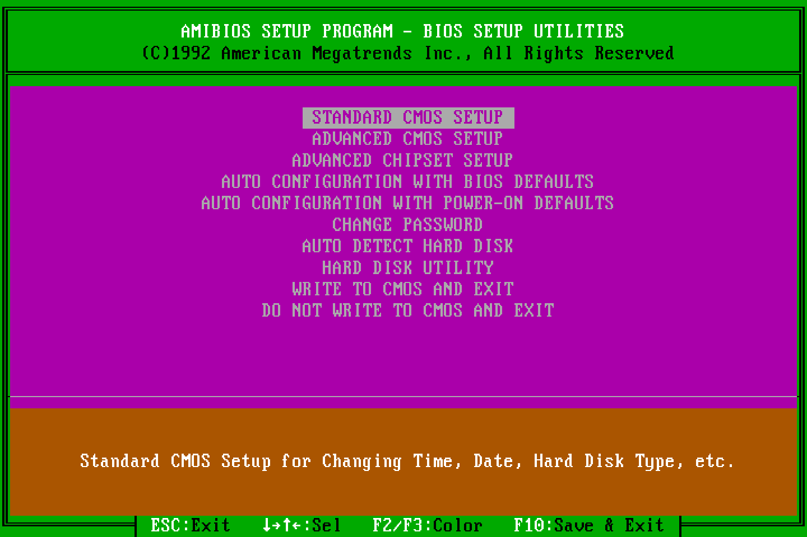

# BUBios for the SOYO SY-019L1

**A rebuilt 1992 AMI BIOS for a 386 board: disks up to 128 GB with LBA, automatic IDE detection, a full-screen POST display and a new setup program, all in the original 64 KB EPROM, and confirmed on real hardware.**

The SOYO SY-019L1 (386DX-40, OPTi 82C495SLC) shipped with an AMI BIOS dated 11/11/92 that could not use more than **504 MB** of a hard disk. This project first lifted that limit, then kept going. The result is BUBios:

- **Large disks.** ECHS ("Large") translation takes classic INT 13h CHS to its ceiling of 8.4 GB, and the INT 13h extensions (EDD 1.1, 28-bit LBA) reach up to **128 GB**. Tested with a 20 GB and an 80 GB hard disk and 4, 8 and 16 GB CF cards.
- **Automatic IDE detection** at every boot (a switch in setup). A drive that is configured but not connected is dropped instead of stalling POST for a minute.
- **A full-screen POST display** with CPU, measured clock, coprocessor, cache, a live memory test, each disk's model name and geometry, ports and option ROMs, then a **3-second boot countdown** with DEL for setup. Settings changed in setup restart POST by themselves.
- **A new setup program** in the style of MR BIOS: tabs, a Summary page, typed date and time, six colour schemes.
- **CF-card friendly.** Fixes MS-DOS missing floppy swaps when a CF card is on the IDE bus.
- **A reference for modding other BIOSes.** Every changed byte is documented, the builds assert every patch site, and emulators run the real ROM's INT 13h code, setup program and complete POST. Two guides turn the work into a method you can reuse.

Everything runs on the board with MS-DOS 7.1 and Windows 95 B.


| Original AMI setup | BUBios setup |
|---|---|
|  |  |

## The ROMs

**Status: complete.** Both ROMs are final and confirmed on the board.

| ROM (64 KB, 27C512) | What it is | MD5 |
|---|---|---|
| [`BUBios/binary/BUBIOS2_SY019L1.BIN`](BUBios/README.md) | **BUBios 2.1**: everything above | `b975393064d7b8a387dd7bf6e5d32286` |
| [`binary/SY019L1_27C512_CHSPATCH.BIN`](docs/HOW_THE_PATCH_WORKS.md) | **ECHS patch v5** only: disks up to 8.4 GB, original AMI screens | `8e520e91100f932d3f054883b08d37da` |
| `binary/SY019L1_27C512_ORIGINAL.BIN` | the original AMI BIOS dump | `e80a824d8f3c39d40b98a4be5d8d9cff` |

The project grew in two parts, and the repository is laid out the same way:

1. **The ECHS patch** (repository root). The original goal: lift the 504 MB limit to the INT 13h CHS ceiling of 8.42 GB (7.84 GiB), without LBA and within the 64 KB EPROM. 353 bytes of new code and five small patch sites. Confirmed with an 8 GB CF card (16000/16/63 → 1002/255/63) that partitions, formats, benchmarks and boots from C:.
2. **BUBios** ([`BUBios/`](BUBios/README.md)). Built on top of the ECHS ROM, with its disk code unchanged: the new setup, the POST screen, auto-detection and LBA. AMI's dead code (the configuration box and the low-level-format Hard Disk Utility) was removed to make room; about 10 bytes of the ROM are left.

## Using the ROM

1. Program `BUBios/binary/BUBIOS2_SY019L1.BIN` (or the ECHS-only ROM) into a 27C512 EPROM. **Keep the original chip:** this BIOS generation has no recovery block.
2. In setup, enter each drive's **physical** geometry as type 47 (the setup's auto-detect fills it in). With BUBios you can instead switch on *Auto-Detect Disks at Boot* on the Tools page.
3. Partition and format under the new ROM. The BIOS shows DOS a translated geometry of up to 1024/255/63 (8.4 GB); with BUBios, MS-DOS 7.1 / Windows 95 OSR2 and later reach the rest of the disk through LBA. Drives of up to 1024 cylinders need no translation and keep the geometry the original BIOS reported, so their partitions stay valid. Larger drives partitioned under another BIOS or translation scheme must be repartitioned.
4. DOS FAT16 partitions are limited to 2 GB; use several partitions, or MS-DOS 7.1 / Windows 9x with FAT32.

Changing a drive's type-47 geometry later changes the translated geometry, so existing partitions would no longer be readable. Both ROMs translate identically, so a disk moves between them without repartitioning.

## Documentation

| Document | What it covers |
|---|---|
| [`Project_Overview.md`](Project_Overview.md) | Status, tested hardware, tooling and where to find what. **Start here** if you want to work on the code. |
| [`BUBios/README.md`](BUBios/README.md) | BUBios in full: every feature, every hook, build and tests |
| [`BUBios/CHANGELOG.md`](BUBios/CHANGELOG.md) | BUBios version history, build by build, with every bug found on the board |
| [`CHANGELOG.md`](CHANGELOG.md) | ECHS patch version history (v1 → v5) |
| [`docs/HOW_THE_PATCH_WORKS.md`](docs/HOW_THE_PATCH_WORKS.md) | Every byte the ECHS patch changes, with pseudo code |
| [`docs/BIOS_ADDRESS_MAP.md`](docs/BIOS_ADDRESS_MAP.md) | Verified address map of this ROM, including every address BUBios uses |
| [`docs/BIOS_Evaluation.md`](docs/BIOS_Evaluation.md) | ECHS development log: root cause, and the six bugs with their diagnosis |
| [`docs/CHS_TRANSLATION_PORTING_GUIDE.md`](docs/CHS_TRANSLATION_PORTING_GUIDE.md) | How to add ECHS translation to another legacy BIOS |
| [`docs/BIOS_MODDING_GUIDE.md`](docs/BIOS_MODDING_GUIDE.md) | How to add LBA, a POST screen and a new setup to another legacy BIOS |

## Repository layout

```
README.md                  this file
Project_Overview.md        status, tested hardware, tooling, where to find what
CHANGELOG.md               ECHS patch version history
CLAUDE.md                  notes for AI assistants working in this repository
LICENSE

docs/                      ECHS documentation and the two porting guides
binary/                    original ROM dump and the ECHS-patched ROM
asm/xlate.asm              NASM source of the ECHS translation routines (+ listing)
py/                        ECHS build, emulator harness and tests
  build.py                 assemble + splice + patch + checksum -> ECHS ROM, checks the MD5
  ide_harness.py           Unicorn real-mode emulator for the ROM's INT 13h code
  regress.py               geometry / read / register regression test
  boot_test.py             runs the ROM's INT 19h boot path
  verify_model.py          translation math in plain Python
  analyze_bios.py          reproduces the ROM-structure facts in the address map

BUBios/                    BUBios: README, CHANGELOG, and its own self-contained build
  binary/                  BUBIOS2_SY019L1.BIN, plus copies of the original and ECHS ROMs in base/
  asm/                     bubios.asm (setup), post.asm (POST, LBA), lba_test_mbr.asm
  py/                      build, setup and POST emulators, tests, screenshots
  shots/                   screenshots of every setup page and the POST screen
  tools/                   DSKCHG.COM, a DOS floppy change-line tester
```

## Building and testing

Requires Python 3 and [NASM](https://www.nasm.us). The emulator tests need [Unicorn](https://www.unicorn-engine.org/) (`pip install unicorn`); BUBios's screenshots also need `pip install pillow`. The ECHS build checks its result against the confirmed MD5; the BUBios build prints the MD5 of its result for comparison with the one above.

ECHS patch, from the repository root:

```sh
python3 py/build.py        # rebuilds binary/SY019L1_27C512_CHSPATCH.BIN and checks its MD5
python3 py/regress.py      # 10 geometries, pinned AH=08h results, 44 reads each
python3 py/boot_test.py    # INT 19h boot path, original vs patched
python3 py/verify_model.py # translation math, no dependencies
```

BUBios, from the `BUBios` folder:

```sh
python3 py/build_bubios.py # builds binary/BUBIOS2_SY019L1.BIN from binary/base/
python3 py/test_bubios.py  # 74 setup checks
python3 py/test_post.py    # 94 checks of POST, countdown, auto-detect, LBA (25-35 minutes)
python3 py/regress_echs.py # the ECHS regression and boot test on the BUBios ROM
```

## Modding another BIOS

This repository is meant to be a reference. For a different legacy BIOS, start with [`docs/CHS_TRANSLATION_PORTING_GUIDE.md`](docs/CHS_TRANSLATION_PORTING_GUIDE.md) (mapping an unknown ROM, ECHS, the emulator approach, and the traps behind six real bugs), then [`docs/BIOS_MODDING_GUIDE.md`](docs/BIOS_MODDING_GUIDE.md) (reclaiming ROM space, hooking POST, replacing the setup, adding the INT 13h extensions). [`CLAUDE.md`](CLAUDE.md) tells an AI assistant how to use the repository for that.

## License

The patch sources, scripts and documentation are released under the MIT License (see `LICENSE`).

The ROM images in `binary/` and `BUBios/binary/` contain AMI BIOS code, which remains the copyright of American Megatrends Inc. They are provided for the preservation and repair of this board only.

The screenshot font in `BUBios/py/vgafont.py` is the IBM VGA 9×16 font from VileR's [Ultimate Oldschool PC Font Pack](https://int10h.org/oldschool-pc-fonts/), licensed CC BY-SA 4.0.
